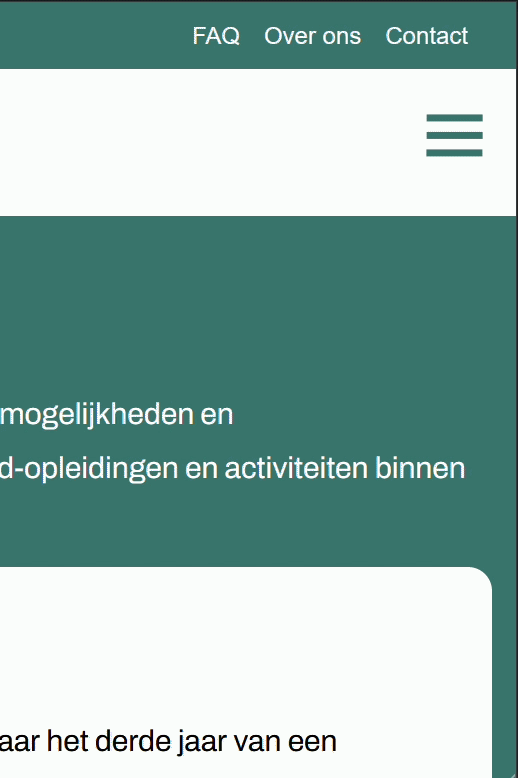
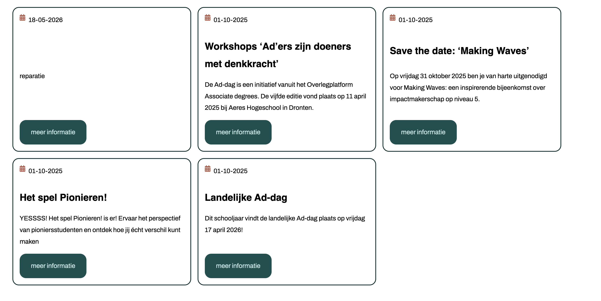

# Pleasurable User Interface

Ontwerp en maak met een team voor een opdrachtgever een interface waar gebruikers blij van worden.

De instructie vind je in: [INSTRUCTIONS.md](https://github.com/fdnd-task/pleasurable-ui/blob/main/docs/INSTRUCTIONS.md)

## Inhoudsopgave

- [Beschrijving](#beschrijving)
- [Kenmerken](#kenmerken)
- [Installatie](#installatie)
- [Bronnen](#bronnen)
- [Licentie](#licentie)

## Beschrijving

<!-- Bij Beschrijving staat kort beschreven wat voor project het is en wat je hebt gemaakt -->
<!-- Voeg een mooie poster visual toe 📸 -->
<!-- Voeg een link toe naar Github Pages 🌐-->

Ad Connect is een website om meer informatie te krijgen over AD's. Op AdConnect kan je ook het laatste nieuws lezen, kandidaten bekijken voor de talent awards en meer te weten komen over LAdO's. Je kan hem nu [hier](https://pleasurable-ui-vyle.onrender.com/) bekijken.

## Kenmerken

<!-- Bij Kenmerken staat welke technieken zijn gebruikt en hoe. Wat is de HTML structuur? Wat zijn de belangrijkste dingen in CSS? Wat is er met JS gedaan en hoe? Misschien heb je iets met NodeJS gedaan, of heb je een framwork of library gebruikt? -->

### LAdO's

Voor de LAdO pagina wordt data dynamisch opgehaald uit Directus via een fetch request in de Express server. Deze data wordt vervolgens gerenderd met Liquid templates en herbruikbare partials.

Het overzicht van de LAdO's is gebouwd met een accordion interface door gebruik te maken van de native `<details>` en `<summary>` elementen. Hierdoor blijft de informatie overzichtelijk, toegankelijk en makkelijk scanbaar voor gebruikers.

De accordion is uitgebreid met progressive enhancement technieken en vloeiende animaties. Met CSS transitions opent en sluit de content soepel wanneer gebruikers een accordion item openen of sluiten.

Ook is rekening gehouden met accessibility door zichtbare focus states en ondersteuning voor toetsenbordnavigatie toe te voegen. De pagina maakt gebruik van CSS Grid zodat de kaarten op grotere schermen netjes naast elkaar worden weergegeven.

### Contact page

Voor de contactpagina is een volledig werkend formulier ontwikkeld met Liquid templates, Express en CSS. Gebruikers kunnen via het formulier hun naam, e-mailadres en bericht versturen.

De ingevulde formuliergegevens worden via een POST route in de Express server verstuurd naar een Directus collectie zodat contactaanvragen dynamisch opgeslagen kunnen worden.

Daarnaast is extra aandacht besteed aan accessibility en usability. Het formulier bevat duidelijke labels, zichtbare focus states en verplichte velden zodat het formulier goed bruikbaar blijft voor toetsenbord- en screenreadergebruikers.

### Animaties

#### Knoppen
Om de gebruiker visueel te laten zien wat er na een klik gebeurt, zijn knopanimaties toegevoegd voor een laad- en successstaat. Tijdens het verzenden krijgt de knop een loading state en na verzenden in de back-end wordt de button omgezet naar een succes staat button.

De animatie bestaat uit JavaScript en CSS. In JavaScript krijgt de knop tijdelijk een extra class waardoor de visuele styling verandert. Deze styling is opegmaakt in CSS.

#### Pagina laden

Bij het navigeren tussen pagina's is een animatie dat bestaat uit het logo van ADConnect toegevoegd. Zodra een link wordt aangeklikt, verschijnt de loading overlay die laat zien dat de volgende pagina wordt geladen.

### Hamburgermenu

De website heeft voor mobiele gebruikers een mooi hamburger slide menu. Gemaakt met een popover en geanimeerd met css en javascript. De hamburger menu kan gesloten worden door erbuiten te klikken of door op escape te klikken. Als de gebruiker JS aan heeft dan krijgen ze mooie animaties bij het openen en sluiten van het menu.



### Back to top

### News

bij de nieuws pagina wordt alle nieuws berichten in een grid met blokken te laten zien.



deze blokken worden herbruikt in de home pagina.

## Installatie

<!-- Bij Instalatie staat hoe een andere developer aan jouw repo kan werken -->

Om dit project op te starten volg je deze stappen

1. clone het project lokaal
2. installeer het project
   ```bash
   npm install
   ```
3. start het project op
   ```bash
   npm run start
   ```

## Conventions

Read about our code conventions [here](./conventions.md).

## Bronnen

https://ishadeed.com/article/range-syntax/

## Licentie

This project is licensed under the terms of the [MIT license](./LICENSE).
